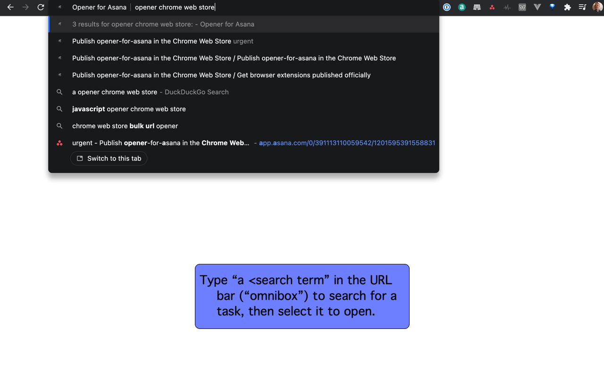
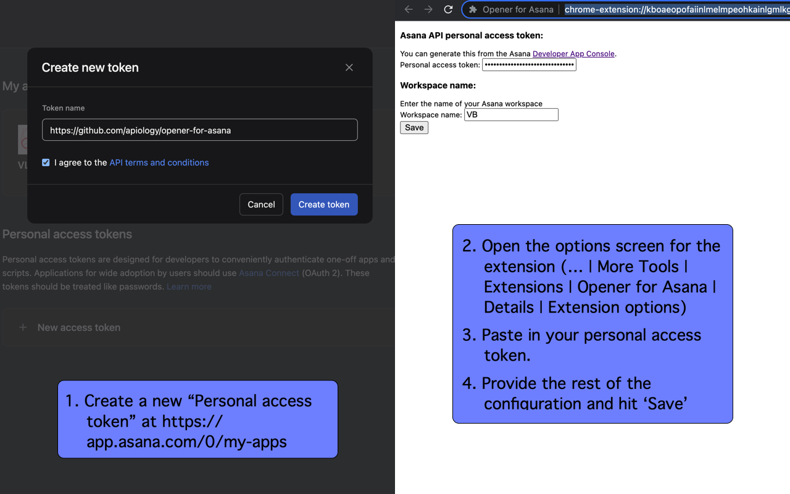

# Opener for Asana

Searches for and opens an Asana task in the Chrome Omnibox

## Using

Go to the URL bar ("Chrome Omnibox"), and type 'a', a space, then
search for an Asana task.  You should see them pop up as suggestions.
Pick one, and your task will be opened in a new tab!

## Configuration

1. Create a new "Personal access token" in
   [Asana](https://app.asana.com/0/my-apps)
2. Open the options screen for the extension (… | More Tools |
   Extensions | Opener for Asana | Details | Extension options)
3. Paste in your personal access token.
4. Provide the rest of the configuration and hit 'Save'

## Legal

Not created, maintained, reviewed, approved, or endorsed by Asana, Inc.

## Contributions

This project, as with all others, rests on the shoulders of a broad
ecosystem supported by many volunteers doing thankless work, along
with specific contributors.

In particular I'd like to call out:

* [Audrey Roy Greenfeld](https://github.com/audreyfeldroy) for the
  cookiecutter tool and associated examples, which keep my many
  projects building with shared boilerplate with a minimum of fuss.
